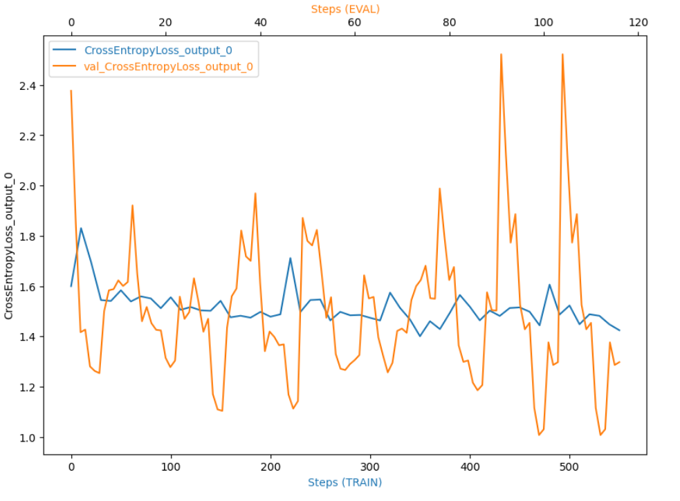

# Inventory Monitoring at Distribution Centers

Inventory monitoring at distribution centers is a critical task to ensure that the correct number of items are in stock and available for delivery. To improve the accuracy and efficiency of this process, machine learning, deep learning, and computer vision technologies can be utilized on AWS Sagemaker. In this project, the focus is on developing a model that can accurately count the number of objects in each bin that is being moved by robots in the distribution center. This requires a robust model that can handle multiple objects in a bin and can detect them even when they are partially obstructed. The use of deep learning models, such as convolutional neural networks (CNNs), can provide the required accuracy in object detection and recognition. AWS Sagemaker provides a comprehensive set of tools and services for training and deploying machine learning models at scale. It also supports computer vision tasks through Amazon Rekognition, which can help in analyzing and detecting objects in images and videos. By deploying the model on AWS Sagemaker, the system can be easily integrated with existing distribution center infrastructure and be used for real-time inventory monitoring. This would enable distribution centers to accurately track their inventory and ensure that delivery consignments have the correct number of items, leading to improved operational efficiency and customer satisfaction.

## Project Set Up and Installation
All required package installations are carried out in the `sagemaker.ipynb` file. No extra configuration is needed.

## Dataset

### Overview
The Amazon Bin Image Dataset, containing 500,000 images of bins containing one or more objects (maximum of 5 objects and minimum of 1), will be used for this project. The dataset also includes a metadata file containing information about each image, such as the number of objects, dimension, and object type. The dataset will be preprocessed and cleaned before training the machine learning model.

We are going to use a subset of 10,000 images of this dataset which is then splitted into two partitions for training, and validation with ratios of  %85 and %15 respectively. The number of images are balanced among classes, i.e., there will be an equal number of train, and validation images for each class (number of objects in bin). 

### Access
The images, after being resized and splitted, are uploaded into an S3 bucket to be accessed by the trainnig instance in training jobs. the bucket name and data location is passed to thye training job configuration function.

## Model Training
For this classification task, we chose the ResNet-50 model architecture with the ImageNet pre-trained weights, to be fine-tuned on our data, we also used adam optimizer for training the model. We used Pytorch, and Sagemaker's PyTorch Estimator module to implement and configure the model. Then we trained the initial model for 10 epochs using batch-size=128 and determined other hyperparametrs through hp tuning.

The training steps and pipeline is derfined in `train.py` script file. Also the hp optimization steps and pipeline are derfined in `hpo.py` 

## Machine Learning Pipeline
The Pipeline is consisted of following parts:

- data collection
- data exploration
- data preprocessing
- baseline model training
- improving the baseline by:
    - Hyperparameter optimization
    - Data Augmentation
- Evaluation and Analysis

